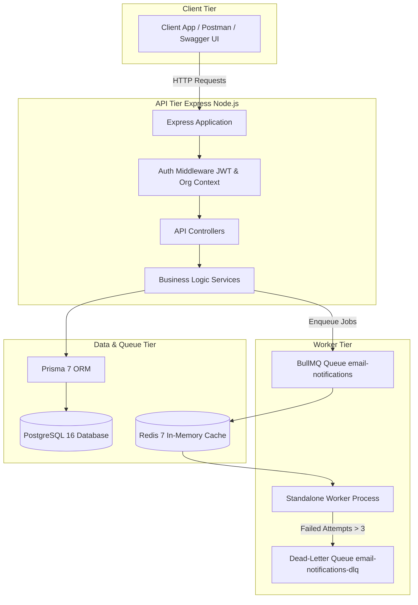
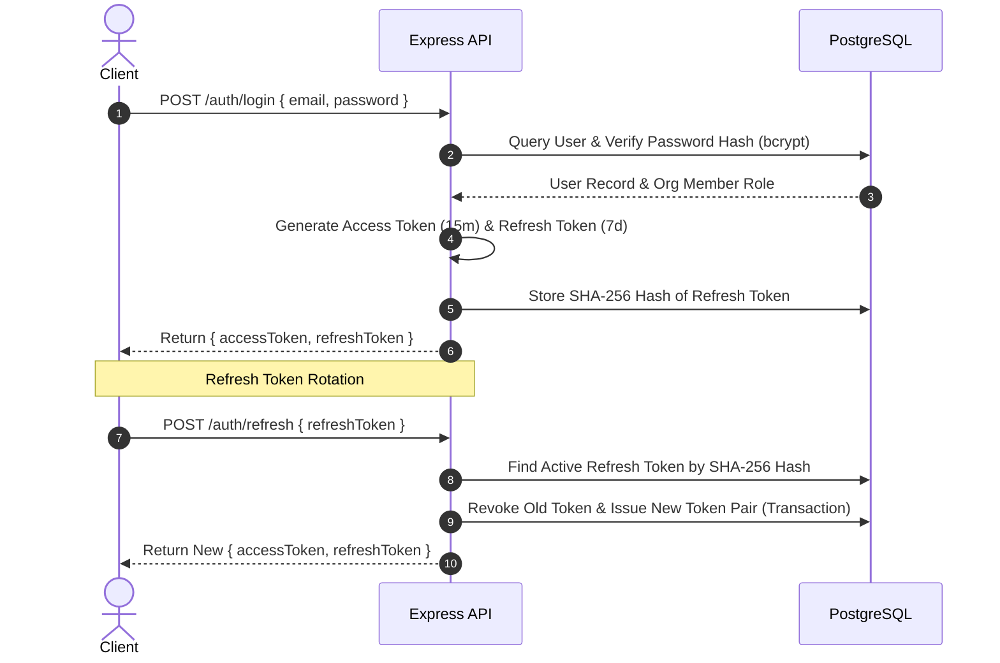
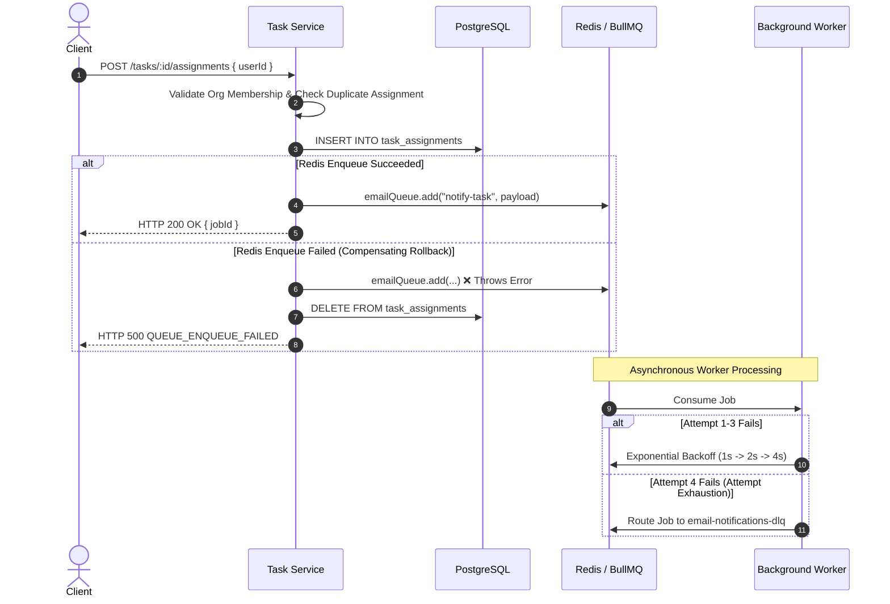
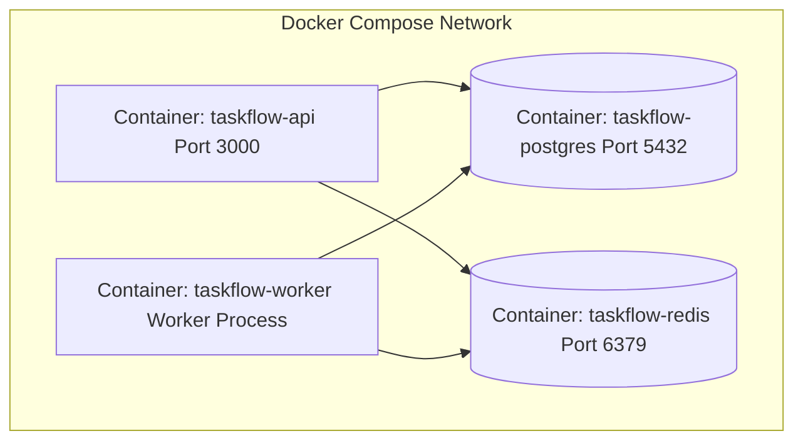

# TaskFlow System Architecture Document

This document describes the high-level architecture, design patterns, data flows, multi-tenant isolation, error handling, worker retry mechanics, and container topology for the **TaskFlow Backend System**.

---

## 1. High-Level Architecture Overview

TaskFlow is designed as a decoupled, multi-tenant, event-driven REST API and asynchronous worker system built on Node.js, Express, TypeScript, PostgreSQL, Redis, and BullMQ.



---

## 2. System Components & Responsibilities

### 1. Express API Server (`src/server.ts` & `src/app.ts`)
* Provides standard HTTP REST endpoints for authentication, project management, task management, assignment, job status, and documentation.
* Implements security headers (`helmet`), CORS, body parsing, rate limiting (`express-rate-limit`), and global error handling middleware.

### 2. Authentication & Security Layer (`src/middleware/auth.middleware.ts`)
* Decodes incoming Bearer JWT Access Tokens.
* Validates token authenticity and extracts user identity.
* Fetches user's active organization membership and attaches `req.user = { id, email, organizationId, role }` to the Express request object.
* Enforces Role-Based Access Control (RBAC): `requireRole(Role.org_admin)` strictly protects destructive operations such as `DELETE /projects/:id`.

### 3. Service & Business Logic Layer (`src/modules/*/service.ts`)
* Implements business rules, validation checks, pagination calculations, filtering clauses, and domain transactions.
* Guarantees organization isolation by injecting `organization_id: req.user.organizationId` into every database query.

### 4. Data Layer (`src/lib/prisma.ts` & `prisma/schema.prisma`)
* Uses **Prisma 7** with `@prisma/adapter-pg` SQL Driver Adapter.
* Manages 8 PostgreSQL models: `users`, `organizations`, `org_members`, `projects`, `tasks`, `task_assignments`, `comments`, and `refresh_tokens`.
* Enforces foreign key integrity, cascade deletion for child models, and unique constraints for multi-tenant data safety.

### 5. Asynchronous Message Broker (`src/queues/email.queue.ts`)
* Powered by **BullMQ** and **Redis**.
* Manages two queues:
  * Primary Queue: `email-notifications`
  * Dead-Letter Queue (DLQ): `email-notifications-dlq`

### 6. Background Worker Process (`src/worker.ts` & `src/modules/notifications/email.worker.ts`)
* Independent Node.js process running decoupled from the Express API server.
* Consumes notification jobs from Redis, executes mock email logging, and handles retries with exponential backoff.

---

## 3. High-Level Data Flows

### A. Authentication & Refresh Token Rotation Flow



### B. Task Assignment & Resilient Queue Data Flow



---

## 4. Multi-Tenant Security & Isolation Model

Multi-tenant security in TaskFlow is guaranteed by the following design rules:

1. **Zero Client Trust**: Client-supplied organization IDs in request parameters, query strings, or request bodies are strictly ignored.
2. **Server-Derived Context**: Organization context is derived exclusively from the authenticated user's organization membership in PostgreSQL during JWT authentication.
3. **Database Query Scoping**: Every database lookup, list, update, and delete query enforces:
   ```typescript
   where: {
     id: resourceId,
     organization_id: req.user.organizationId
   }
   ```
4. **Cross-Tenant Access Rejection**: Attempting to query, modify, assign, or delete resources belonging to another organization yields **`403 FORBIDDEN`** without disclosing whether the resource exists.

---

## 5. Resiliency & Worker Retry Policy

* **Total Attempts**: `4` (1 initial attempt + 3 retries)
* **Backoff Type**: Exponential (`delay: 1000ms`)
* **Retry Timeline**:
  * Initial Attempt: Immediate
  * Retry #1: 1 second delay
  * Retry #2: 2 seconds delay
  * Retry #3: 4 seconds delay
  * Attempt Exhaustion: Status updated to `failed` and job pushed to `email-notifications-dlq`.

---

## 6. Docker Container Orchestration Topology



* **`taskflow-postgres`**: PostgreSQL 16 Alpine database container.
* **`taskflow-redis`**: Redis 7 Alpine in-memory broker container.
* **`taskflow-api`**: Node.js Express API container running `npm run start`.
* **`taskflow-worker`**: Node.js BullMQ background worker container running `npm run worker`.
